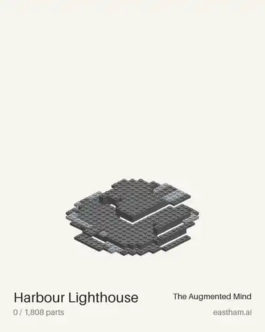
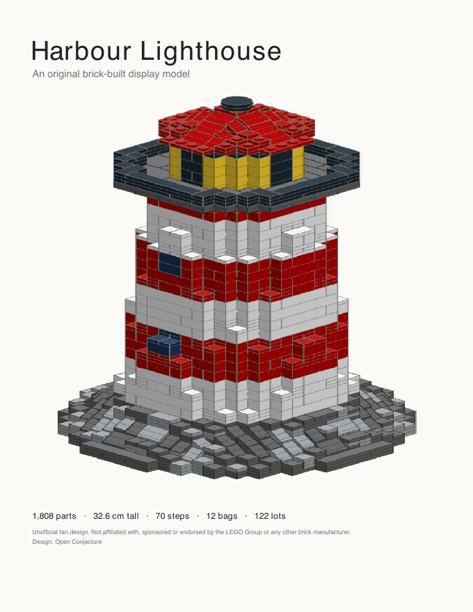
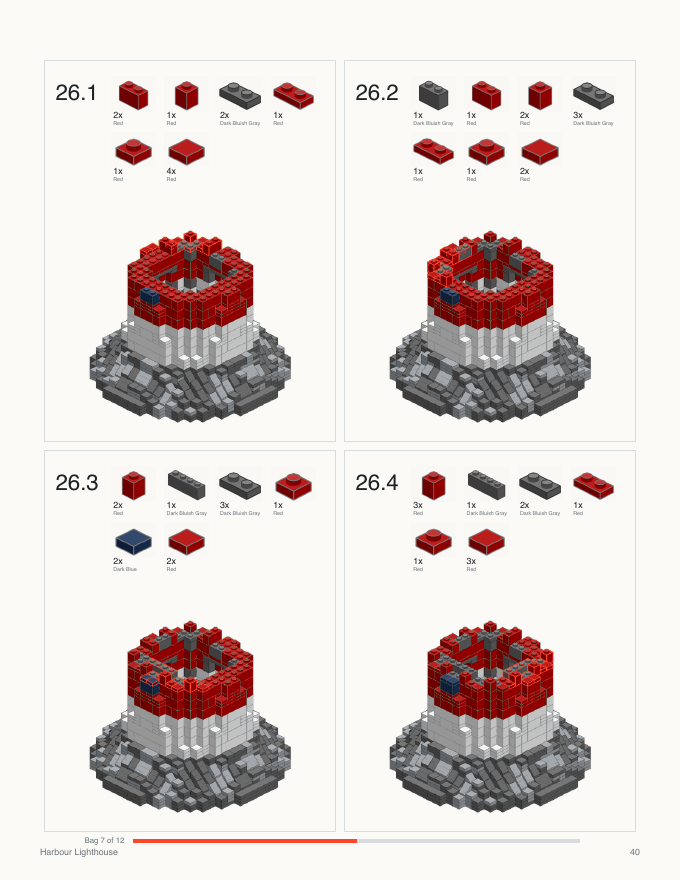
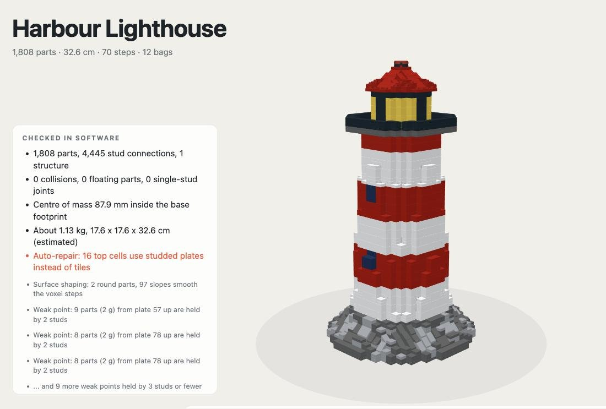
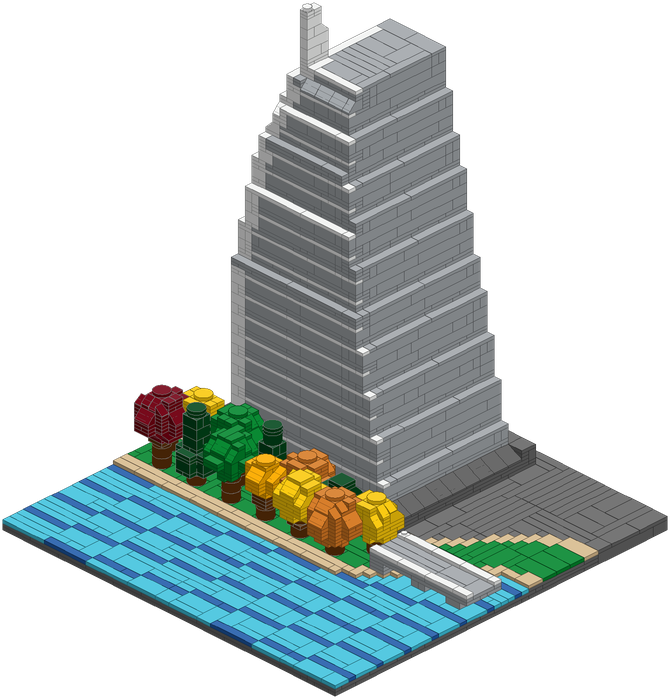

<p align="center">
  
</p>

<p align="center">
  <b>Turn a photo, a doodle or a wild idea into a brick model you can actually build.</b><br>
  Real parts. Checked in software. With the instruction book, a 3D viewer and a shopping list.
</p>

<p align="center">
  <a href="https://github.com/geastham/snapwright/actions/workflows/tests.yml"></a>
  <a href="LICENSE"></a>
  <a href="https://skills.sh"></a>
  
</p>

<p align="center">
  
</p>

---

## Hi! What is this?

**Snapwright** is an agent skill for Claude (and other coding agents). Ask for a brick
version of your dog, your house, a rocket you modelled, a sunset photo, and it:

1. **designs** it on a stud-and-plate grid, looking at your picture and scoring its own likeness,
2. **packs it into real parts**: bricks, plates, tiles, slopes, corner slopes, round bricks and
   sideways-built faces, only in colours those parts are actually made in,
3. **checks it like a grumpy engineer**: one piece, nothing floating, nothing held on by a
   single stud, and it won't tip over,
4. and hands you **everything you need to build it**.

| | |
|:-:|:-:|
|  |  |
| **A printable instruction book**: bags, numbered steps, a callout of the new parts with colour names, and a progress bar | **Steps you can follow**: every part lands on something already built; tricky ones get an x-ray outline |

<p align="center">
  
</p>
<p align="center"><b>An interactive 3D viewer</b> (one HTML file, works offline): build playback, step by step,<br>
exploded panels, record to video, and the honest list of what the software checked.</p>

Plus **LDraw** files for Studio / LeoCAD / Mecabricks, a **BrickLink** wanted list, a
**Rebrickable** CSV and, if you ask, a **build video** (MP4) of the model assembling itself.

## Gallery

Every one of these passes the checks. Click a picture to open its 3D viewer.

| | | |
|:-:|:-:|:-:|
| [](https://geastham.github.io/snapwright/gallery/lakeside-sail-tower.html) | [](https://geastham.github.io/snapwright/gallery/harbour-lighthouse.html) | [](https://geastham.github.io/snapwright/gallery/signal-robot.html) |
| **Lakeside Sail Tower**<br>3,115 parts · 43 cm<br>a lakefront diorama, from two photos | **Harbour Lighthouse**<br>1,808 parts · 33 cm<br>slopes and rounds on the tapers | **Signal Robot**<br>492 parts · 25 cm<br>face and chest built sideways |
| [](https://geastham.github.io/snapwright/gallery/little-rocket.html) | [](https://geastham.github.io/snapwright/gallery/stone-keep.html) | |
| **Little Rocket**<br>485 parts · 24 cm<br>straight from an STL file | **Stone Keep**<br>5,210 parts · 45 cm<br>hollow walls with bracing | |

## Install (30 seconds)

**Claude Code, Cursor, Codex and other agents** (via the open [skills](https://skills.sh) CLI):

```bash
npx skills add geastham/snapwright
```

**Claude.ai / the Claude apps**: download `snapwright.zip` from the
[latest release](https://github.com/geastham/snapwright/releases), turn on *Code execution
and file creation* (Settings → Capabilities), then upload the zip under *Skills*
([how](https://support.claude.com/en/articles/12512180-use-skills-in-claude)).

It needs Python with numpy, scipy, pillow and reportlab (the Claude sandbox has them). No
GPU, no network (except refreshing the parts catalog), about 300 KB.

## Things to ask it

> Here's a photo of our dog Biscuit. Turn him into a brick sculpture about 20 cm tall, with instructions I can print.

> Design a small brick lighthouse my 7-year-old can build, under 400 pieces.

> Make a 48 x 48 mosaic of this sunset and give me a BrickLink wanted list.

> I 3D-modelled a rocket (rocket.stl, Z-up). Make it a brick model, white with red fins.

> The base of my model keeps tipping over. Fix it and regenerate the book.

It builds original things, your own things, generic things, real places and public-domain
works, and politely offers an original design instead of copying someone else's character.

## How it works


- **The packer** lays bricks in courses with staggered joints, anchors overhangs, and
  smooths tapers and curves with slopes, corner slopes, inverted slopes and round parts.
- **The repair loop** fixes what didn't join up, least invasive first: re-pack, then studs
  instead of tiles, then one recoloured cell, and only as a last resort trims an overhang.
- **Nothing is hidden.** Every automatic change is counted and printed in the log, the book
  and the viewer.
- **Parts that exist.** The catalog knows which colours each part has actually been made
  in (from Rebrickable's set inventories), and the packer sticks to those.
- **Deterministic.** Same design, same seed, same model. `model.json` regenerates everything.

It's *checked in software*: nobody has built your model until you build it. If something
doesn't click, [tell us](https://github.com/geastham/snapwright/issues) and we'll teach the
packer.

## For tinkerers

```bash
make setup        # numpy, scipy, pillow, reportlab (+ pytest)
make test         # ~150 tests in ~20 s
make example      # builds the lighthouse into examples/lighthouse/out/
python skills/snapwright/scripts/sw.py preview my_design.py --out out/preview
python skills/snapwright/scripts/sw.py compare my_design.py --ref photo.jpg
python skills/snapwright/scripts/sw.py build   my_design.py --out out --audience family
python skills/snapwright/scripts/sw.py video   out/model.json --out out/build.mp4
```

The skill lives in `skills/snapwright/`. There are also `examples/`, `creations/` (our own
builds), `evals/` (how we test the skill with and without it, see
[docs/evals.md](docs/evals.md)) and `tools/`. The roadmap is in [SPEC.md](SPEC.md), and
[CONTRIBUTING.md](CONTRIBUTING.md) explains how to help.

## Credits

Made by [Open Conjecture](https://github.com/geastham) and
[The Augmented Mind](https://eastham.ai). MIT licensed.

Snapwright is unofficial and independent: not affiliated with, sponsored or endorsed by any
brick manufacturer or marketplace (see [NOTICE.md](NOTICE.md)). The 3D viewer uses
[three.js](https://threejs.org) (MIT).
