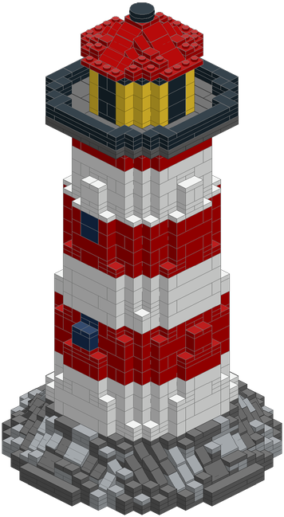
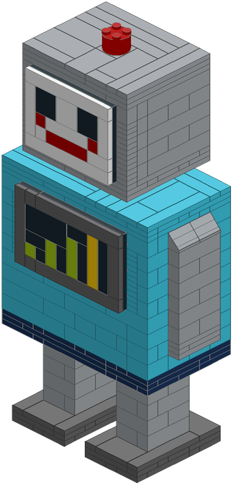
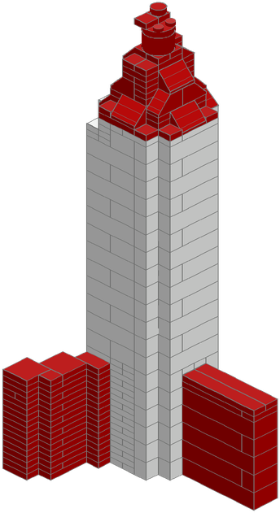
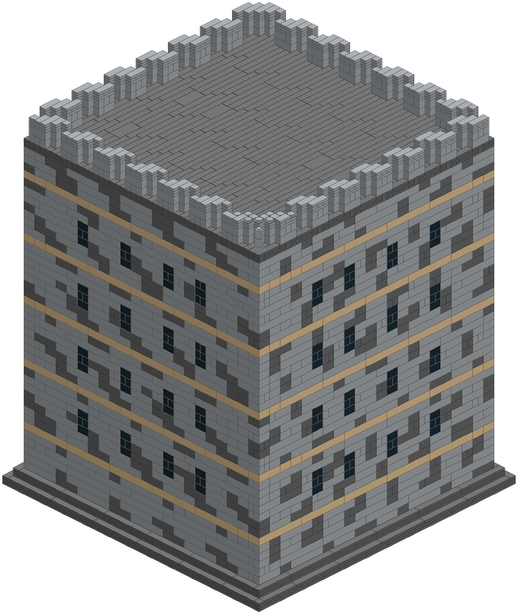

# Snapwright

Design buildable brick models with Claude: photo, sketch or idea in; verified parts layout,
instruction book, 3D build viewer and parts lists out.

- **Design**: Claude writes a short design file in a voxel DSL (or starts from an OBJ/STL/GLB)
  and iterates on previews and a silhouette likeness score against the reference.
- **Brickify**: bricks, plates and tiles with staggered joints, anchored overhangs and a repair loop;
  slopes, inverted slopes and round parts where the surface tapers or curves; optional hollowing
  with internal bracing; an automatic base for models that would tip; sideways-built panels
  (faces, signs) clipped onto side studs.
- **Check**: one structure, nothing floating, no collisions, balance, weak joints, colour availability.
- **Document**: step-by-step PDF, three.js viewer with build playback, LDraw, BrickLink XML, Rebrickable CSV.

## Gallery

Every model below passes the software checks. Click a picture for the 3D build viewer (build
playback, step by step, exploded panels); each example's design file is in `examples/`.

| | | | |
|:-:|:-:|:-:|:-:|
| [](https://geastham.github.io/snapwright/gallery/harbour-lighthouse.html) | [](https://geastham.github.io/snapwright/gallery/signal-robot.html) | [](https://geastham.github.io/snapwright/gallery/little-rocket.html) | [](https://geastham.github.io/snapwright/gallery/stone-keep.html) |
| **Harbour Lighthouse**<br>1,808 parts · 32.6 cm<br>slopes and rounds on the tapers | **Signal Robot**<br>492 parts · 25 cm<br>face and chest built sideways | **Little Rocket**<br>485 parts · 24 cm<br>from an STL; thin fins kept | **Stone Keep**<br>5,210 parts · 45 cm<br>hollow with bracing; `make bench` |

The lighthouse builds with its book in about 20 s on a laptop; the keep in under 2 minutes.
Regenerate the gallery with `python tools/gallery.py`.

```bash
make setup
make test           # unit, regression-fixture, property and golden tests (~40 s)
make example        # builds examples/lighthouse/out/
python skills/snapwright/scripts/sw.py preview my_design.py --out out/preview
python skills/snapwright/scripts/sw.py compare my_design.py --ref photo.jpg   # likeness score
python skills/snapwright/scripts/sw.py build   my_design.py --out out --audience family
```

Install as a Claude skill: `make package` → upload `dist/snapwright.skill` (about 110 KB).

Part-colour availability comes from Rebrickable's set inventories (colours each part has
appeared in since 2005), and the packer only uses combos that exist. Refresh it with
`sw.py sync-catalog` (downloads the free CSV dumps; `--key` uses the API instead). See
CONTRIBUTING.md for adding parts and running the evals.

Layout: `skills/snapwright/` (the skill), `examples/`, `creations/` (our own builds),
`evals/`, `tests/`, `docs/`. Roadmap and acceptance criteria: `SPEC.md`.

Unofficial and independent; see NOTICE.md. Checked in software only: build before you trust it.
