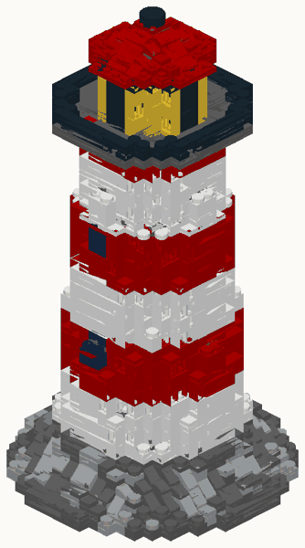
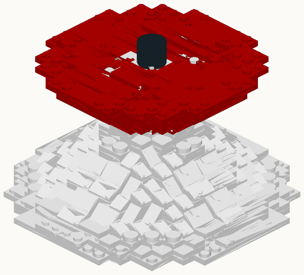
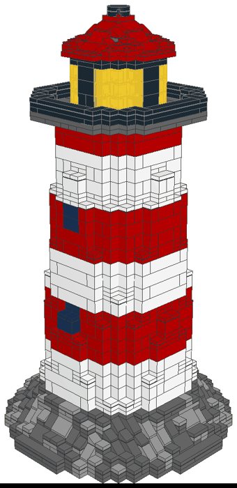
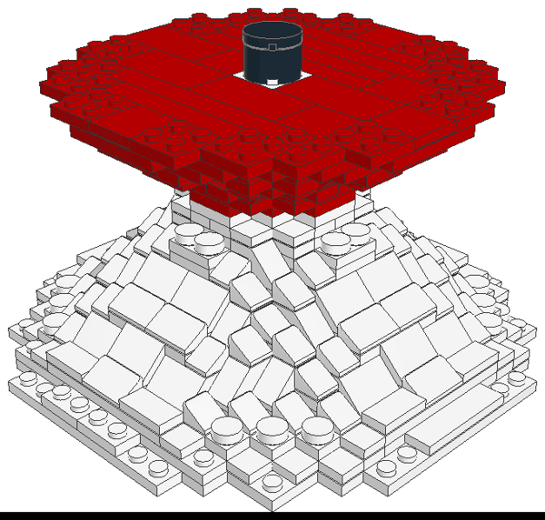

# LDraw export check (M2)

SPEC M2 asks for the LDraw export to be verified in an LDraw editor. What was done:

## Automated check against the official LDraw library

`tools/ldraw_check.py` loads an exported `.ldr` with the real part geometry from the
official library (`complete.zip` from library.ldraw.org, unzipped anywhere), and for every
part line checks that

- the part's bounding box (studs excluded) lands exactly on the grid box `model.json`
  says it occupies (x, z, y, width, depth, height), and
- each slope's sloped face points the direction the model records (inverted slopes: the
  chamfer underneath does).

It then renders the model from the official triangles. Mutation test: flipping three slope
matrices and shifting one brick by a stud in the `.ldr` gives 7 reported problems, so the
check is not vacuous.

```bash
make ldraw-check LDRAW_LIB=/path/to/ldraw        # checks examples/lighthouse/out
```

Results (2026-09-25):

| Model | Parts | Result |
|---|---|---|
| `examples/lighthouse` | 1,767 (97 slopes, 109 rounds) | all match the official geometry |
| shaped test (cone + flare + round column) | 652 (108 slopes, 24 inverted, 24 rounds, all four slope directions) | all match |

Official-geometry renders (flat shading, painter's algorithm; transparency not drawn):

 

## LeoCAD

Checked 2026-09-25 with LeoCAD 26.09 (official macOS release) and the LDraw library 26.08,
rendering the last step of each exported file from the command line:

```bash
LeoCAD -l complete.zip -i out.png -w 900 -h 1100 -f LAST -t LAST --viewpoint home model.ldr
```

Both open without missing parts. Slopes face outward on all four sides of the cone, the
inverted slopes form the chamfer under the flare, rounds sit centred, and the lighthouse's
rock base, lantern mullions and roof match the Snapwright renders.

 

## Orientation facts used by the exporter

From the official part files: box parts have their origin at the top centre with the long
axis along X. Brick-height slopes (3040b, 3039, 4286, 3298) and inverted slopes (3665a, 3660)
have their origin at the top centre of the studded back row and run towards -Z. The 2/3-height
30 degree slopes (54200, 85984) have their origin at the bottom centre. Rounds are centred.
