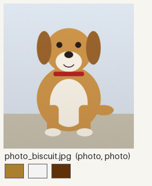
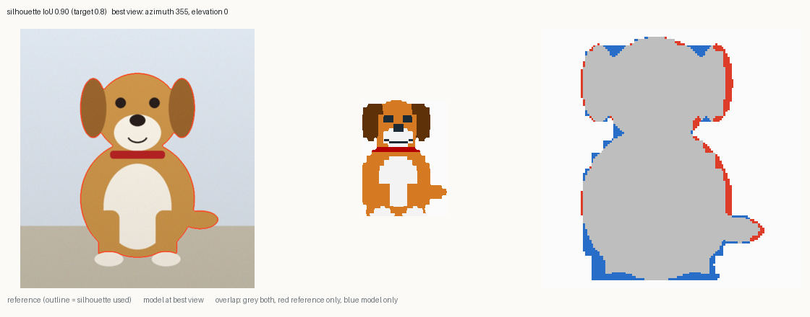
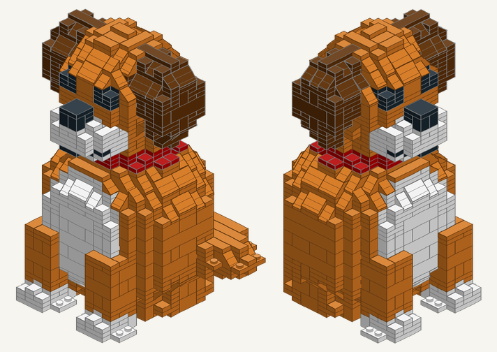
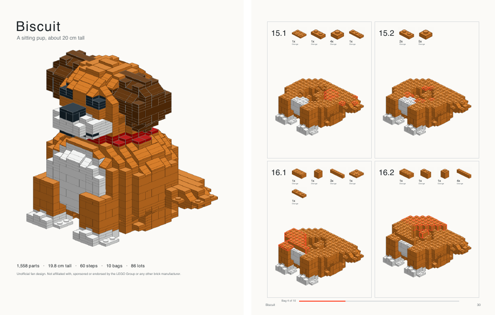
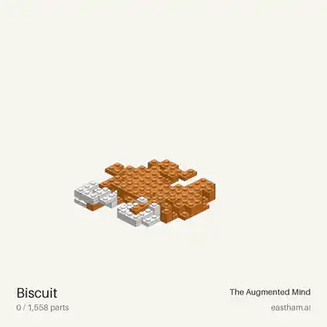

# Make your own creation

The skill walks you through a creation step by step. You bring the idea and some pictures; it
asks a couple of questions, tells you which pictures it still needs (and gives you prompts to
make them), and checks back with you at each stage. Here's the whole flow, recorded on a real
run: **Biscuit**, a cartoon dog drawn for this repo.

**Start it** in Claude.ai or Claude Code, with the skill installed, by saying something like:

> I'd like to make a brick sculpture of our dog Biscuit. Here's a photo. Walk me through it.

## 1. Three quick questions

The skill asks, in one message and with defaults if you just say "go":
- **What is it, and is it yours?** An original, your own pet, home or art, a generic thing, a
  real place, or something public domain. It offers an original design instead of copying
  someone else's character.
- **How big, or how many pieces?** For example "about 20 cm" or "under 400 pieces".
- **Who's building it?** Kids, family, adult or expert. This sets how many parts go in each
  step.

It also asks whether you want just the model or a little **diorama** (ground, water, trees).

## 2. A project folder

It makes a folder for the creation (`sw.py new "Biscuit the Dog"`) with a brief, a
`reference/` folder for your pictures, and a design file. Drop your photos in, or attach
them to the chat.

## 3. References: what it has, what it needs

It checks every picture (`sw.py refs`): does it show the whole subject on a clean
background, which brick colours does it suggest, and which views are still missing?

One photo is enough to start. For a good likeness it wants a **clean straight-on front and
side view** (plain background, no perspective), and it prints a ready-to-paste prompt for
each missing view, like this one:

> Draw the side, straight on (a side elevation). Subject: A cartoon dog called Biscuit sitting
> down: caramel fur, floppy brown ears, white muzzle and chest, red collar. Show ONLY the
> subject, whole and centred with about 10% margin, on a plain flat white background, no
> shadows, no other objects, no text or logos. Orthographic (straight-on, no perspective)...

If the assistant you're using can generate images, it makes those views itself. Otherwise
paste each prompt into your favourite image generator with your photos attached, and put the
results in `reference/` as `view_front.png`, `view_side.png` and so on. It checks the
generated views against your photos, since they're interpretations, not photos.

## 4. The brief

It writes up a short brief:
- the size in studs and plates;
- the 3-5 features that make it *Biscuit* (the floppy ears, the white muzzle, the red
  collar), each big enough to read in bricks;
- the colours, the proportions, and anything structural (will it tip? is the tail too thin?).

It checks the size and rough part count with you, because that's the one decision that's
expensive to change later.

## 5. Block-out and likeness

It designs the model, previews it from four sides, and **scores the likeness**: it finds the
camera angle where the brick model best matches your picture and measures how much the
outlines overlap. It keeps refining until that's above 80%, then shows you:

This is where you say "the ears should be floppier" or "make the collar red". Your eye beats
the score.

## 6. Build and check

It packs the design into real parts and checks the result in software:
- **Connections:** one piece, nothing floating, nothing hanging on a single stud.
- **Balance:** it won't tip over.
- **Parts:** every part-colour combination has actually been made.

It fixes what fails, tells you about any automatic repair, and shows you the built model:

## 7. Everything you need to build it

In the creation's `out/` folder:

| file | what it is |
|---|---|
| `biscuit-instructions.pdf` | **the instruction book**, ready to print: cover, parts list, bags, numbered steps |
| `biscuit-viewer.html` | **the 3D viewer**: open it in any browser (offline too), play the build, step through it |
| `biscuit-bricklink.xml` | **the order list** for BrickLink ([how to order](ordering.md)) |
| `biscuit-rebrickable.csv` | the parts list for Rebrickable |
| `biscuit-parts.csv` | a readable parts list with a BrickLink link for every part |
| `biscuit.ldr` | the model for Studio, LeoCAD or Mecabricks |

And if you ask for it, **a build video** of the model assembling itself (MP4, ready to post):

## 8. Build it for real

Order the parts ([ordering.md](ordering.md)), print the book, and build. If anything doesn't
click, tell the skill what happened: it fixes the design, and we'd love to hear about it in
an [issue](https://github.com/geastham/snapwright/issues) so the packer gets smarter.

---

*For agents:* the stage-by-stage instructions the skill follows are in
[`skills/snapwright/references/wizard.md`](../skills/snapwright/references/wizard.md).
